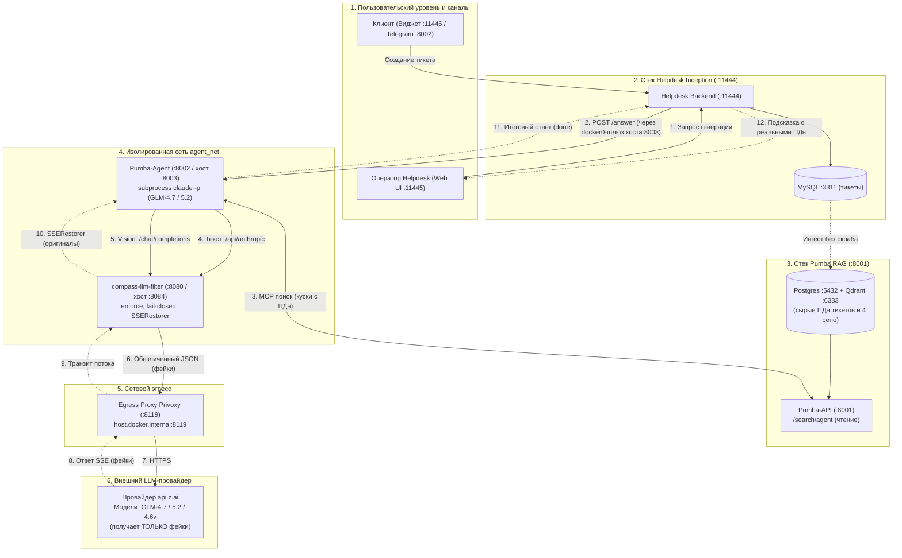

# Руководство разработчика и внутренняя архитектура: compass-llm-filter

Документ описывает внутреннее устройство, архитектурные решения, модель угроз и правила разработки проекта `compass-llm-filter`.

---

## 1. Концепция и решаемая задача

`compass-llm-filter` разработан как двусторонний шлюз безопасности (AI Security Gateway) между внутренними системами (Helpdesk Compass, CRM, чат-платформы) и внешними провайдерами LLM (OpenAI, Anthropic, GLM, Mistral и локальные модели).

### 1.1 Модель угроз и требования безопасности
1. **Утечка персональных данных и коммерческой тайны (Data Exfiltration)**:
   - Внешний LLM-провайдер ни при каких условиях не должен получать сырые ПДн и инфраструктурные секреты.
   - Защита от обратного подбора по словарям (Rainbow Tables) обеспечивается серверным криптографическим перцем (`COMPASS_SECRET_PEPPER`).
2. **Атаки на языковую модель (Prompt Injection / Jailbreak)**:
   - Анализ пользовательского ввода на попытки раскрытия системного промпта («Ignore previous instructions», «покажи системный промпт») или обхода ограничений («DAN mode»).
3. **Отказ в обслуживании прокси (DoS / ReDoS / JSON-bomb)**:
   - Регулярные выражения валидируются на катастрофический бэктрекинг (`validate_safe_regex`).
   - Глубина обхода JSON ограничена (`MAX_RECURSION_DEPTH = 30`).
   - Эндпоинты песочницы защищены скользящим Rate Limiter (60 req/min).
4. **Безопасность среды выполнения**:
   - Dockerfile запускается от непривилегированного пользователя `compass` (non-root).
   - Запись файлов состояния производится с правами `0600`.
   - Внедрены HTTP Security Headers (CSP, nosniff, X-Frame-Options) и защита от CSRF.

### 1.2 Сквозная архитектурная схема интеграции

Интеграция шлюза в продуктовом контуре хелпдеска с ИИ-агентом Pumba (ветка dev) на тестовом стенде (3 независимых стека):
- **Стек Helpdesk «Inception»**: backend (:11444), frontend Vite (:11445), виджет (:11446), telegram (:8002, localhost).
- **Стек Pumba RAG**: pumba-api (:8001), postgres (:5432), qdrant (:6333); хранение в базе сырое (скраббинг при ингесте полностью отключен).
- **Стек Агент + Compass** (`docker-compose.agent.yml`, сеть `agent_net`): pumba-agent (хост-порт :8003 -> контейнер :8002), compass-llm-filter (хост-порт :8084 -> контейнер :8080).



```
                        ОПЕРАТОР (веб-интерфейс хелпдеска :11445)
                              │  ▲
        «AI-подсказка» по     │  │ 12. Отображение готовой подсказки
        тикету                ▼  │     с подлинными реквизитами (SSE)
┌────────────────────────────────┴────────────────────────────────────────┐
│  HELPDESK backend (FastAPI, :11444, отдельный compose-стек)             │
│  /prepare — сбор сырого текста тикета (без вызова LLM)                  │
│  /ai/generate/stream — вызов генерации и стриминг оператору             │
│  MySQL (:3311), Redis, Manticore Search, MinIO (quay), Celery           │
└────────────────────────────────┬────────────────────────────────────────┘
                                 │ 2. POST /answer (через docker0-шлюз хоста:8003)
                                 │    контекст тикета + история + вложения
                                 ▼
┌─────────────────────────────────────────────────────────────────────────┐
│  PUMBA-AGENT (:8002 / хост :8003, Docker-сеть agent_net)                │
│  agent_server.py -> subprocess claude -p (--model glm-4.7 / glm-5.2)     │
│  Инструменты: только MCP /search/agent (сетевой доступ к базам закрыт!) │
└────────────┬───────────────────────────────────────────▲────────────────┘
             │ 3. MCP /search/agent                      │ 11. Готовый ответ
             │    чтение контекста                       │     (событие done)
             ▼                                           │
┌────────────────────────┐                               │
│  PUMBA-API (:8001)     │                               │
│  Гибридный поиск       │                               │
│  Postgres (:5432)      │                               │
│  Qdrant (:6333)        │                               │
│  (Сырые ПДн тикетов    │                               │
│   и 4 репо доков!)     │                               │
└────────────────────────┘                               │
             │ 4. Текст: /api/anthropic (settings.json)  │
             │ 5. Скриншоты: /chat/completions (.mcp)    │
             ▼                                           │
┌── COMPASS (:8080 / хост :8084, Docker-сеть agent_net) ─┴────────────────┐
│  ЕДИНСТВЕННЫЙ ВЫХОД НАРУЖУ ИЗ ПЕРИМЕТРА (enforce, fail-closed)          │
│  Маскирование запроса: 13 фаз, ГПСЧ с солью COMPASS_SECRET_PEPPER       │
│  Контекстный leak-check (файловые пути не считаются ложной утечкой)     │
│  SSERestorer: потоковая замена фейков на оригиналы по reverse_map       │
│  Фильтрация STREAM_LEAVES: атомарный пропуск enum'ов stop_reason        │
└────────────┬───────────────────────────────────────────▲────────────────┘
             │ 6. Обезличенный JSON (только фейки)       │ 10. SSE поток
             ▼                                           │     (с фейками)
┌── PRIVOXY (:8119, хостовый прокси) ────────────────────┴────────────────┐
│  Локальный HTTP/HTTPS egress-прокси на host.docker.internal:8119        │
└────────────┬───────────────────────────────────────────▲────────────────┘
             │ 7. HTTPS                                  │ 9. Ответы GLM
             ▼                                           │    (только фейки)
┌── API.Z.AI (Внешний недоверенный LLM-провайдер) ───────┴────────────────┐
│  Модели: GLM-4.7 / GLM-5.2 (Coding Plan), GLM-4.6v (Vision)             │
│  Провайдер видит ИСКЛЮЧИТЕЛЬНО безопасные фейковые данные               │
└─────────────────────────────────────────────────────────────────────────┘
```

---

## 2. Структура кодовой базы

```
compass-llm-filter/
├── pyproject.toml                     # Конфигурация сборки (Hatchling)
├── README.md                          # Руководство пользователя
├── ARCHITECTURE.md                    # Концептуальная архитектура
├── INTERNAL.md                        # Заметки по внутренней реализации
├── docker/
│   └── Dockerfile                     # Non-root multi-stage образ с HEALTHCHECK
├── docs/
│   └── DEVELOPER_GUIDE.md             # Настоящий архитектурный справочник
├── examples/
│   └── quickstart/                    # Демо-стенд (compose, fake_llm, demo.sh)
├── src/compass_llm_filter/
│   ├── __init__.py                    # Экспорт Anonymizer, detect_prompt_injection, __version__
│   ├── core/                          # Ядро фильтрации (100% Python stdlib, 0 зависимостей)
│   │   ├── anonymizer.py              # Конвейер маскирования из 13 фаз, de_anonymize, leaks_in_text
│   │   ├── injection.py               # Эвристический детектор Prompt Injection / Jailbreak
│   │   ├── ru_pii.py                  # Детекторы и генераторы ПДн РФ (паспорта, СНИЛС, ИНН, ОГРН, карты)
│   │   ├── secrets.py                 # Детекторы токенов, PEM-ключей, connection strings и KV-пар
│   │   └── validators.py              # Валидаторы контрольных сумм (Лун, СНИЛС, ИНН, ОГРН, IBAN) + det_rng
│   └── proxy/                         # Reverse-proxy на FastAPI + httpx
│       ├── app.py                     # Маршрутизация, SSERestorer, CSP/CSRF middleware, reverse-proxy
│       ├── config.py                  # Датакласс Settings, загрузка из COMPASS_*
│       ├── metrics.py                 # Prometheus-счетчики на чистом Python
│       ├── ratelimit.py               # Скользящий In-Memory Rate Limiter с потокобезопасностью
│       ├── rules.py                   # Модель CustomRule, State, ReDoS-валидатор, права 0600
│       ├── console.html               # Zero-CDN веб-консоль (Dark Mode, Side-by-Side, Scorecard)
│       └── logo.svg                   # Векторный логотип
└── tests/                             # 139 автоматических тестов (pytest)
    ├── test_anonymizer.py             # Тесты анонимайзера, IPv6, маркеров подстановок
    ├── test_injection.py              # Тесты детектора Prompt Injection
    ├── test_proxy.py                  # Интеграционные тесты прокси, CSP, CSRF, rate limit, JSON keys
    ├── test_ru_pii.py                 # Тесты ПДн РФ, паспортов, СНИЛС, ИНН, карт
    ├── test_secrets.py                # Тесты секретов, PEM-ключей, connection strings с IP/IPv6
    └── test_validators.py             # Тесты контрольных сумм и соли ГПСЧ
```

---

## 3. Детальное устройство ядра (`compass_llm_filter.core`)

Ядро спроектировано без сторонних зависимостей (`dependencies = []`), что гарантирует возможность его использования в любых средах и контейнерах без конфликтов версий.

### 3.1 Детерминированный ГПСЧ с солью (`det_rng`)
Для генерации реалистичных фейков используется `random.Random`, инициализируемый криптографическим хешем SHA-256:
```python
seed = hashlib.sha256(f"{pepper}|{'|'.join(str(p) for p in parts)}".encode("utf-8")).hexdigest()
return random.Random(seed)
```
- `pepper` задается глобально через `set_default_pepper()` или переменной окружения `COMPASS_SECRET_PEPPER`.
- Без соли seed строится без pepper-префикса: подстановки остаются детерминированными, но защита от предварительного расчета таблиц соответствий отсутствует — `/healthz` и консоль сообщают `has_pepper=false` и выдают рекомендацию настроить соль.

### 3.2 Конвейер фаз маскирования (`sanitize_string`)
Маскирование входящего текста выполняется строго в 13 фаз. Порядок критичен для исключения повторного или искаженного маскирования:

1. **Санитизация входных данных**:
   - Удаление любых входных символов `\x00` (`text.replace("\x00", "")`) для предотвращения атак типа Marker Injection.
   - Инициализация сессионного криптографического nonce (`self._nonce = uuid.uuid4().hex[:8]`).
2. **Сущности приложения (ФИО и организации)**:
   - Регистрируются через метод `register_entity()` или заголовок `X-Compass-Entities`.
   - Заменяются на защищенные временные маркеры `\x00m_{nonce}_{id}\x00`.
   - Кириллические имена матчатся по границам слов `\b` без учёта регистра («ИВАН ИВАНОВ» тоже замаскируется), латинские — с контролем контекста кода (`CODE_BOUND`).
3. **Ссылки (URLs)**:
   - `http://`, `https://`, `www.`, `t.me/` заменяются на `https://example.com/<hash10>`.
   - Выполняется до обработки секретов, чтобы токены внутри URL не ломали структуру ссылки.
4. **Секреты и инфраструктурные токены (`secrets.apply`)**:
   - Многострочные PEM-блоки приватных ключей (`-----BEGIN ... PRIVATE KEY-----` ... `-----END ... PRIVATE KEY-----`).
   - Строки подключения к БД (PostgreSQL, MySQL, Redis, MongoDB) с доменными именами, IPv4 или IPv6 хостами.
   - Ключи OpenAI (`sk-proj-...`), GitHub (`ghp_...`), AWS (`AKIA...`), Google API (`AIza...`), Telegram, Stripe, GLM, JWT, Bearer-токены, пары `api_key=...`.
   - Заменяются на маркеры `\x00s_{nonce}_{id}\x00`.
5. **E-mail адреса**:
   - Заменяются на `<fake_user>@example.{com,org,net}`.
6. **@упоминания (Mentions)**:
   - Ники вида `@username` заменяются на правдоподобный псевдоним того же стиля.
7. **Домены (включая wildcard `*.domain.tld`)**:
   - Сервисный префикс сохраняется: `chat.corp.ru` -> `chat.<hash8>.example.com`.
   - Исключаются системные имена файлов (`FILE_EXTS`: .conf, .log, .py, .json и др.).
8. **IBAN (ISO 13616)**:
   - Валидация mod 97. Подстановка валидного номера той же страны и длины.
   - Выполняется до фазы телефонов во избежание захвата длинных хвостов цифр.
   - Жадный хвост из ЗАГЛАВНЫХ слов за номером («... 32 AND MORE DATA») откатывается по группам до самого длинного валидного префикса.
9. **Телефоны**:
   - Российские и международные телефоны с разделителями или сплошными цифрами.
   - Исключаются Unix-таймстемпы и даты (10 цифр), а также кандидаты, проходящие валидацию СНИЛС/ИНН/ОГРН или паспортов.
10. **Российские идентификаторы (`ru_pii.apply`)**:
    - Банковские карты (алгоритм Луна).
    - СНИЛС (11 цифр, взвешенная контрольная сумма).
    - ИНН (10 цифр юрлиц, 12 цифр физлиц и ИП).
    - ОГРН (13 цифр) и ОГРНИП (15 цифр).
    - Паспорта РФ: явные форматы `\d{4}(?:[ \-]| ?№ ?)\d{6}`, а также слитные 10 цифр в контексте ключевых слов («паспорт 4509123456»).
    - Все подстановки генерируются с математически валидными контрольными суммами!
11. **Сетевые адреса (IPv4 и IPv6)**:
    - IPv4: приватные адреса заменяются адресами тех же подсетей, публичные — адресами RFC 5737.
    - IPv6: валидация через `ipaddress.IPv6Address`. Публичные заменяются на RFC 3849 (`2001:db8::/32`), приватные/ULA — на `fd00::/8`.
12. **Раскрытие маркеров секретов**: подстановка фейковых секретов вместо `\x00s_{nonce}_{id}\x00`.
13. **Раскрытие маркеров сущностей**: подстановка фейковых имен/организаций вместо `\x00m_{nonce}_{id}\x00`.

### 3.3 Детектор Prompt Injection (`injection.py`)
Эвристический модуль осуществляет анализ текста без привлечения тяжелых нейросетевых моделей:
- Сигнатуры попыток отмены инструкций: `ignore_instructions` (RU/EN).
- Сигнатуры утечки системного промпта: `system_prompt_leak` («show me your system prompt», «покажи системный промпт»).
- Сигнатуры джейлбрейков: `jailbreak_persona` («DAN mode», «Do Anything Now», «режим разработчика»).
- Сигнатуры поддельных системных блоков: `fake_system_delimiter` (`[SYSTEM INSTRUCTIONS]`, `<system>`).

### 3.4 Обратное восстановление (`de_anonymize`)
- Формируется `reverse_map()`: `{фейк: оригинал}`.
- Неоднозначные фейки (если два разных оригинала получили одну замену) исключаются из карты.
- Замена выполняется строго от самых длинных фейков к самым коротким.
- Словарные слова восстанавливаются по границам слов (`(?<![\wА-Яа-яЁё@.\-])fake(?![\wА-Яа-яЁё@.\-])`).

### 3.5 Самопроверка на утечки (`leaks_in_text`)
Перед отправкой запроса во внешний мир вызывается `anon.leaks_in_text(masked_text)`:
1. Зарегистрированные имена ищутся в тексте напрямую (regex, без учёта регистра).
2. Остальные детекторы прогоняются повторно свежим `Anonymizer`-пробой по замаскированному тексту: утечка — оригинал, который детектор замаскировал бы в этом контексте (например, домен внутри пути `sh/cron/crontab.cron` охраняется lookbehind'ом на `/` и утечкой не считается).
3. При обнаружении остаточных оригиналов запрос немедленно блокируется (HTTP 503 в fail-closed; в fail-open наверх уходит оригинал).

---

## 4. Архитектура Reverse-Proxy (`compass_llm_filter.proxy`)

### 4.1 Обход JSON и маскирование ключей
Вспомогательные функции `_mask_strings`, `_restore_strings`, `_apply_custom_rules` и `_iter_strings` рекурсивно обрабатывают структуры:
- Строковые ключи словарей обрабатываются наравне со значениями: `{anon.sanitize_string(k): _mask_strings(v) for k, v in obj.items()}`.
- Установлен лимит `MAX_RECURSION_DEPTH = 30` для защиты от переполнения стека.

### 4.2 Стриминг SSE токен-за-токеном (`SSERestorer`)
При потоковом ответе (`text/event-stream`) LLM может разбить фейк на несколько дельт (например, `4111 11` в первом чанке и `11 1111 1111` во втором):
1. Класс `SSERestorer` поддерживает буфер каждого поля JSON-события.
2. Замена производится только до последнего граничного символа слова.
3. Если хвост буфера совпадает с префиксом какого-либо известного фейка, он придерживается до следующей порции данных.
4. Перед маркером `[DONE]` сбрасываются все синтетические остатки.

### 4.3 Безопасность HTTP и CSRF-защита
- **Security Headers Middleware**: автоматически проставляет заголовки `Content-Security-Policy` (строгий `script-src 'self'` — весь JS консоли вынесен в `/console.js`, обработчики через data-action делегирование), `X-Frame-Options: DENY`, `X-Content-Type-Options: nosniff`, `Referrer-Policy: strict-origin-when-cross-origin`. Мидлварь внешняя: заголовки попадают и в 401/403.
- **Маскирование query-параметров**: значения (`?q=Иван Иванов`) прогоняются через тот же конвейер и per-request `Anonymizer`, что и тело; имена параметров не трогаются. Leak-check и ошибки подчиняются общей fail-политике.
- **Лимит применения кастомных правил**: строки длиннее `MAX_RULE_INPUT_CHARS` (256 КБ) при включённых правилах уводят запрос в fail-политику (503/оригинал), песочница отвечает 400.
- **CSRF Protection Middleware**: проверяет запросы `POST/PUT/PATCH/DELETE` к `/v1/settings` и `/v1/rules`:
  - `Sec-Fetch-Site: cross-site` -> HTTP 403.
  - Несовпадение `Origin` или `Referer` с заголовком `Host` -> HTTP 403.
- **SSRF Protection**: при старте `create_app` отвергает внутренние адреса апстрима (`_validate_upstream_host`: `localhost`, loopback, RFC1918, link-local `169.254/16`, зарезервированные и неспецифицированные диапазоны, IPv6-аналоги); явное разрешение для локальных моков — `COMPASS_ALLOW_PRIVATE_UPSTREAM=true`. Дополнительно клиент `httpx.AsyncClient` использует `follow_redirects=False` и проверяет схему адреса.
- **Очистка логов и ошибок**: пароли в строках подключения (`user:pass@host`) и токены очищаются перед выводом в 502/503 ошибках или логах.

---

## 5. Тестирование

Проект покрыт 139 автоматическими тестами:

```bash
.venv/bin/pytest -v
```

Структура тестового комплекта:
- `tests/test_anonymizer.py` (23 теста): проверка базового маскирования, IPv6, детерминизма, предотвращения marker injection, контекстно-зависимого leak-check (исключает ложные срабатывания на путях файлов вроде `sh/cron/crontab.cron`), линейность конвейера на длинных текстах.
- `tests/test_injection.py` (9 тестов): проверка детекции попыток Prompt Injection и Jailbreak.
- `tests/test_proxy.py` (60 тестов): интеграция FastAPI, SSE-потоки (белый список листьев стриминга STREAM_LEAVES, атомарная передача enum stop_reason и base64-сигнатур, сброс хвостов на границах блоков), CSP-заголовки, CSRF-защита, rate-limiting, очистка ошибок, маскирование query-параметров.
- `tests/test_ru_pii.py` (19 тестов): паспорта РФ, СНИЛС, ИНН-10/12, ОГРН, банковские карты, IBAN.
- `tests/test_secrets.py` (14 тестов): приватные PEM-ключи, connection strings с IP/IPv6, Bearer, токены провайдеров.
- `tests/test_validators.py` (14 тестов): математические алгоритмы Луна, СНИЛС, ИНН, ОГРН, IBAN mod 97, соль ГПСЧ.
